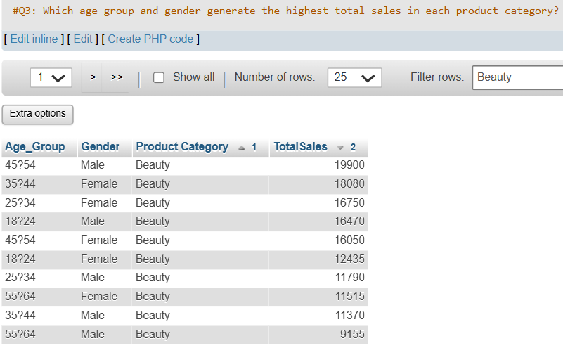
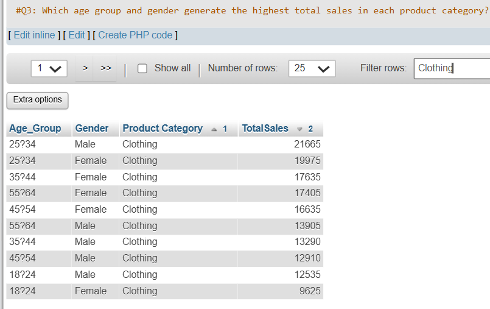
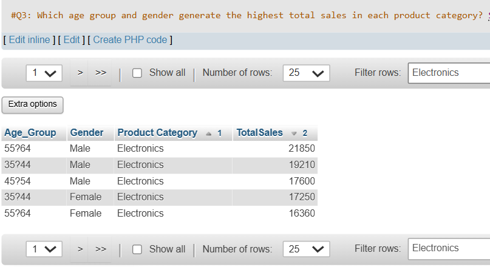
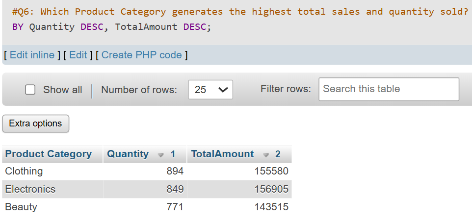
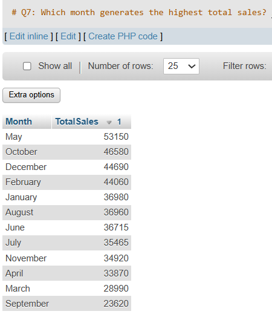
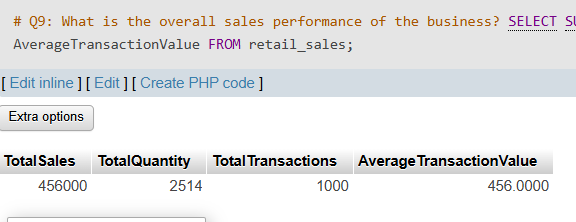

# Retail Sales Analysis Using SQL

## Project Overview

This project analyzes retail transaction data to identify sales trends, customer behavior, and product performance.

## Business Questions

1. Which age group generated the highest and lowest total sales?
2. Which age group generated the highest sales for each product category?
3. Which age group and gender generated the highest total sales in each product category?
4. Which female age group generated the highest Electronics sales?
5. Which age group preferred Single Item, Few Items, or Bulk Purchase?
6. Which product categories generated the highest total revenue and sales volume?
7. Which month generated the highest total sales?
8. Which age group had the highest average transaction value?
9. What was the overall sales performance of the business?
10. Which product category had the highest average transaction value?

## Tools Used

- MySQL
- GitHub
- Power BI

## Data Cleaning

- Checked for missing values.
- Checked for duplicate transaction IDs.
- Validated quantity, price, and total amount.
- Verified date formats.

## Key Insights

- **Overall sales performance:** The business generated total sales of 456,000 from 1,000 transactions.
- **Sales quantity:** A total of 2,514 items were sold.
- **Average transaction value:** The overall average transaction value was 456.00.
- **Product performance:** Electronics generated the highest total sales at 156,905, while Clothing recorded the highest sales volume with 894 items sold.
- **Revenue and volume comparison:** Although Electronics sold fewer items than Clothing, it generated more revenue, indicating a higher average revenue per item.
- **Monthly sales trend:** May recorded the highest total sales at 53,150, accounting for approximately 11.66% of overall sales. September recorded the lowest sales at 23,620.
- **Customer segment performance:** Male customers aged 45–54 generated the highest Beauty sales at 19,900. Male customers aged 25–34 led Clothing sales at 21,665, while male customers aged 55–64 generated the highest Electronics sales at 21,850.
- **Category transaction value:** Beauty had the highest average transaction value at 467.48, followed by Electronics at 458.79 and Clothing at 443.25.

## Q3 Analysis Results






## Q6 Analysis Results


## Q7 Analysis Results


## Q9 Analysis Results



## Recommendations

- Maintain sufficient inventory for Electronics because it generates the highest total sales.
- Ensure adequate stock availability for Clothing because it records the highest number of items sold.
- Investigate the factors behind the strong sales performance in May and assess whether similar strategies can be applied to other months.
- Review product, customer, and promotional patterns in September to identify possible reasons for its lower sales performance.
- Develop category-specific marketing campaigns for the leading customer segments: males aged 45–54 for Beauty, males aged 25–34 for Clothing, and males aged 55–64 for Electronics.
- Explore product bundles and cross-selling opportunities in Beauty to maintain its high average transaction value while increasing total sales volume.

## Repository Structure

```text
retail-sales-analysis/
├── README.md
├── sql/
│   └── analysis.sql
├── data/
│   └── retail_sales.csv
└── images/
    ├── query-results/
    └── dashboard.png
```

- `README.md` — Project overview, business questions, key insights, and recommendations.
- `sql/analysis.sql` — SQL queries for data validation, cleaning, and analysis.
- `data/retail_sales.csv` — Retail transaction dataset.
- `images/query-results/` — Screenshots of SQL query results.
- `images/dashboard.png` — Final dashboard screenshot.
